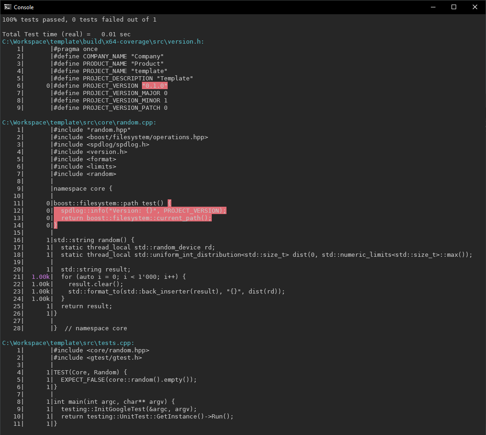

# Template
C++20 project template that uses:

* [`vcpkg`][vcpkg] - a mirrored vcpkg repository
* [`ports`][ports] - a custom ports overlay

<details>
<summary>Boost</summary>

To add boost ports as dependencies:

1. Modify [vcpkg.json](vcpkg.json):

```json5
{
  // ...
  "dependencies": [
    "boost-core",
    "boost-heap",
    "boost-bimap",
    "boost-container",
    "boost-circular-buffer",
    "boost-intrusive",
    "boost-smart-ptr",
    "boost-lockfree",
    "boost-outcome",
    "boost-leaf",
    "boost-asio",
    "boost-beast",
    "boost-json",
    "boost-url",
    "boost-uuid",
    "boost-filesystem",
    "boost-process",
    "boost-program-options",
    // ...
  ]
}
```

2. Modify [CMakeLists.txt](CMakeLists.txt):

```cmake
find_package(Boost CONFIG REQUIRED COMPONENTS core
  heap bimap container circular_buffer intrusive smart_ptr lockfree
  outcome leaf asio beast json url filesystem uuid process program_options)
target_link_libraries(objects PUBLIC ${Boost_LIBRARIES})
```

</details>

## Visual Studio
Required Visual Studio components:

```
Workloads
✅ Desktop development with C++
   ✅ C++ CMake tools for Windows
   ✅ Test Adapter for Google Test
   ✅ vcpkg package manager

Individual Components
✅ Windows Universal C Runtime
✅ C++ Clang Compiler for Windows
```

<details>
<summary>Keyboard Mappings</summary>

The following keyboard mappings are recommended.

```
F9  (Global) Debug.StepOut
F10 (Global) Debug.StepOver
F11 (Global) Debug.StepInto
```

</details>

## Visual Studio Code
The following extensions are recommended for development of this project.

### Extension: C/C++
The [ms-vscode.cpptools][cpptools] extension is used for debugging.

### Extension: clangd
The [llvm-vs-code-extensions.vscode-clangd][clangd] extension is used to show intellisense
information with clang-tidy linter support and to automatically format the code on save.

### Extension: CMake Tools
The [ms-vscode.cmake-tools][cmake] extension is used to configure the project.

### Optional Extension: Reflow Markdown
The [marvhen.reflow-markdown][markdown] extension can be used to reflow markdown files.<br/>
The default keyboard shortcut is `ALT+Q`.

<details>
<summary>Launch Targets</summary>

The `cmake.debugTarget` command uses the `cmake.debugConfig` settings in `.vscode/settings.json`:

```json
{
  "cmake.debugConfig": {
    "name": "Launch",
    "type": "cppvsdbg",
    "request": "launch",
    "console": "internalConsole",
    "program": "${command:cmake.launchTargetPath}",
    "cwd": "${workspaceRoot}",
    "stopAtEntry": false,
    "environment": [],
    "args": [],
  }
}
```

The `workbench.action.debug.start` command can be configured by creating `.vscode/launch.json`:

```json
{
  "configurations": [
    {
      "name": "Launch",
      "type": "cppvsdbg",
      "request": "launch",
      "console": "internalConsole",
      "program": "${command:cmake.launchTargetPath}",
      "cwd": "${workspaceRoot}",
      "stopAtEntry": false,
      "environment": [],
      "args": [],
    }
  ]
}
```

</details>

<details>
<summary>Settings</summary>

The following user settings are recommended.

```json5
{
  // Debug
  "debug.showInStatusBar": "never",
  "debug.toolBarLocation": "commandCenter",
  "debug.internalConsoleOptions": "openOnSessionStart",

  // Terminal
  "terminal.integrated.cwd": "${workspaceFolder}",
  "terminal.integrated.defaultProfile.windows": "Command Prompt",
  "terminal.integrated.copyOnSelection": true,
  "terminal.integrated.rightClickBehavior": "paste",

  // Extension: CMake Tools (ms-vscode.cmake-tools)
  "cmake.launchBehavior": "breakAndReuseTerminal",
  "cmake.pinnedCommands": [
    "workbench.action.tasks.configureTaskRunner",
    "workbench.action.tasks.runTask",
    "workbench.action.tasks.debug"
  ],
  "cmake.options.statusBarVisibility": "hidden",
  "cmake.options.advanced": {
    "configurePreset": {
      "statusBarVisibility": "compact"
    },
    "buildPreset": {
      "statusBarVisibility": "hidden"
    },
    "buildTarget": {
      "statusBarVisibility": "compact"
    },
    "launchTarget": {
      "statusBarVisibility": "compact"
    },
    "build": {
      "statusBarVisibility": "icon"
    },
    "debug": {
      "statusBarVisibility": "icon"
    },
    "launch": {
      "statusBarVisibility": "icon"
    }
  }
}
```

The following keyboard shortcuts are recommended.

```json
[
  { "key": "ctrl+f5",     "command": "cmake.launchTarget" },
  { "key": "f5",          "command": "cmake.debugTarget", "when": "!inDebugMode" },
  { "key": "f5",          "command": "workbench.action.debug.pause", "when": "inDebugMode && debugState == 'running'" },
  { "key": "f5",          "command": "workbench.action.debug.continue", "when": "inDebugMode && debugState != 'running'" },
  { "key": "f9",          "command": "workbench.action.debug.stepOut" },
  { "key": "f10",         "command": "workbench.action.debug.stepOver" },
  { "key": "f11",         "command": "workbench.action.debug.stepInto" },
  { "key": "pausebreak",  "command": "workbench.action.togglePanel" }
]
```

</details>

## CMake
Add the Visual Studio 2022 `cmake.exe` directory to the system `Path` environment variable.

```
C:\Program Files\Microsoft Visual Studio\2022\Community\Common7\IDE\CommonExtensions\Microsoft\CMake\CMake\bin
```

## Command Line
This project provides CMake configure, build, test and workflow presets.

```cmd
:: Format the source code.
format.cmd

:: Build the project in x64 debug mode.
build.cmd x64-debug

:: Build the project in x64 debug mode and run coverage tests.
build.cmd x64-coverage

:: Build the project in x64 release mode and create a package.
build.cmd x64-release

:: Manually test the package.
7z t build\x64-release\template.7z

:: Manually build and run tests.
cmake --preset x64-debug
cmake --build --preset x64-debug --target tests
ctest --preset x64-debug
build\x64-debug\bin\tests.exe

:: Manually build and run benchmarks.
cmake --preset x64-release
cmake --build --preset x64-release --target benchmarks
build\x64-release\bin\benchmarks.exe
```

1. Replace `x64` with `x86` for 32-bit targets.

2. The local compiler cache is located in `.cache/ccache`.<br/>
   This requires the `ccache` executable to be in `PATH`.

3. The local downloads cache is located in `.cache/vcpkg/downloads`.<br/>
   This can be overwritten using the `VCPKG_DOWNLOADS` environment variable.

4. The local vcpkg binaries cache is located in `.cache/vcpkg/binaries`.<br/>
   This can be overwritten using the `VCPKG_BINARY_SOURCES` environment variable.

```cmd
:: The HTTP server has to support `GET` and `PUT` operations.
set VCPKG_BINARY_SOURCES=clear;http,http://localhost:80/vcpkg/cache/{name}/{version}/{sha},readwrite
```

<details>
<summary><b>Nginx Configuration</b></summary>

Minimal `nginx.conf(5)` configuration file for the vcpkg binaries cache.

```nginx
worker_processes 1;

events {
  worker_connections 1024;
}

http {
  include mime.types;
  default_type application/octet-stream;
  keepalive_timeout 65;
  sendfile on;

  map $time_iso8601 $timestamp {
    ~^([0-9-]+)T([0-9:]+) "$1 $2";
  }

  map $remote_addr $address {
    ~^(..............) "$1 ";
    ~^(.............) "$1  ";
    ~^(............) "$1   ";
    ~^(...........) "$1    ";
    ~^(..........) "$1     ";
    ~^(.........) "$1      ";
    ~^(........) "$1       ";
    ~^(.......) "$1        ";
    default $remote_addr;
  }

  log_format access '[$timestamp] $address $status "$request" $body_bytes_sent';

  server {
    listen 80;
    server_name localhost;

    access_log logs/access.log access;

    location /vcpkg/cache {
      alias vcpkg/cache/;
      dav_methods PUT;
      dav_access user:rw group:rw all:rw;
      create_full_put_path on;
      client_max_body_size 0;
      autoindex on;
    }
  }
}
```

</details>

### Coverage


[vcpkg]: https://github.com/qis/vcpkg
[ports]: https://github.com/qis/ports
[cmake]: https://marketplace.visualstudio.com/items?itemName=ms-vscode.cmake-tools
[clangd]: https://marketplace.visualstudio.com/items?itemName=llvm-vs-code-extensions.vscode-clangd
[cpptools]: https://marketplace.visualstudio.com/items?itemName=ms-vscode.cpptools
[markdown]: https://marketplace.visualstudio.com/items?itemName=marvhen.reflow-markdown
